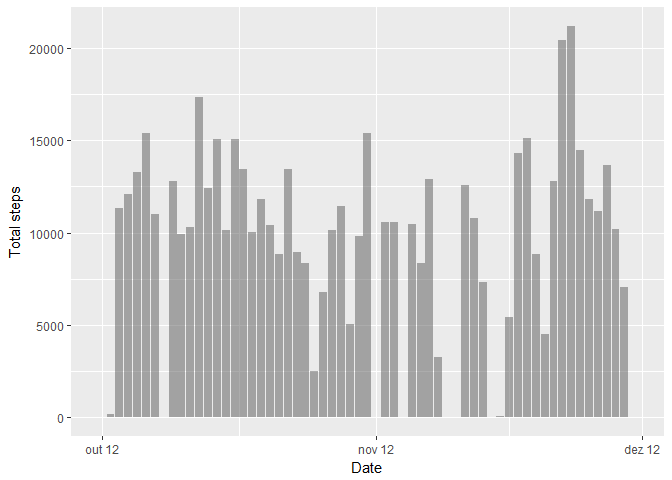
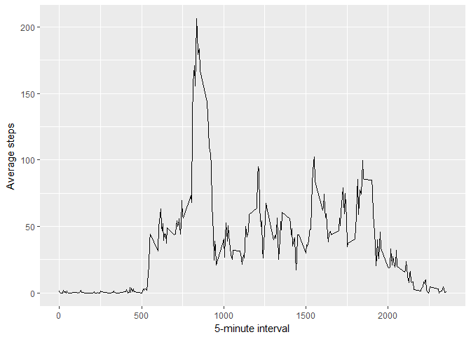
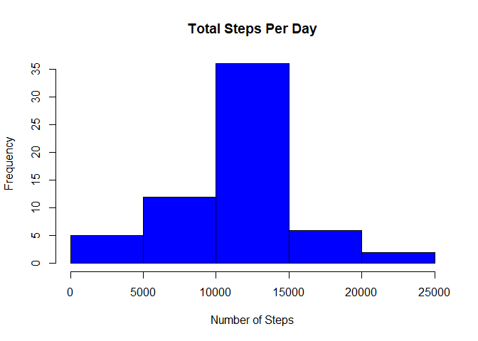
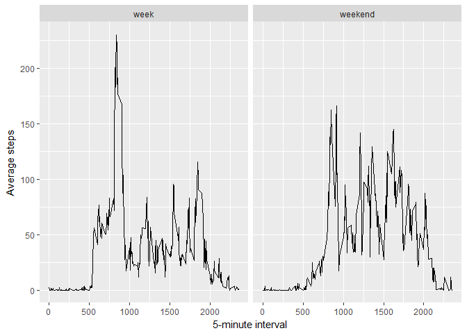

# Reproducible Research: Peer Assessment 1


## Loading and preprocessing the data

### 1. Load the data (i.e. read.csv())

The data will be loaded from the URL below:

https://d396qusza40orc.cloudfront.net/repdata%2Fdata%2Factivity.zip


```r
  zipfile <- tempfile()
  download.file("https://d396qusza40orc.cloudfront.net/repdata%2Fdata%2Factivity.zip",zipfile, method="curl")
  unzip(zipfile)
  unzipedFile<-file("activity.csv")
  activity <- read.table(unzipedFile, sep=",", header=TRUE)
```

### 2. Process/transform the data (if necessary) into a format suitable for your analysis

Needed to convert column "steps" into numeric, as it was loaded as factor.


```r
  activity$hasValue <- !is.na( activity$steps )
  activity[activity$hasValue, 1] <- as.numeric(as.character( activity[activity$hasValue, 1] ))  
  activity[, 2] <- as.Date(activity[, 2])
```

## What is mean total number of steps taken per day?

### 1. Calculate the total number of steps taken per day

```r
aggregated <- aggregate( activity$steps, by=list(Date=activity$date), sum, na.rm=TRUE)

aggregated[, 1] <- as.Date(aggregated[, 1])
```

### 2. If you do not understand the difference between a histogram and a barplot, research the difference between them. Make a histogram of the total number of steps taken each day


```r
hist(aggregated$x, main = paste("Total Steps Per Day"), col="blue", xlab="Number of Steps")
```

<!-- -->

### 3. Calculate and report the mean and median of the total number of steps taken per day


```r
mean <- mean(aggregated$x)

median <- median(aggregated$x)
```

**Mean:** 9354.2295082

**Median:** 1.0395\times 10^{4}

## What is the average daily activity pattern?

### 1. Make a time series plot (i.e. type = "l") of the 5-minute interval (x-axis) and the average number of steps taken, averaged across all days (y-axis)


```r
library(ggplot2)
library("scales")

averaged <- aggregate( activity$steps, by=list(Interval=activity$interval), mean, na.rm=TRUE)

ggplot(averaged, aes(Interval, x)) + geom_line() +
  xlab("5-minute interval") + ylab("Average steps")
```

<!-- -->

### 2. Which 5-minute interval, on average across all the days in the dataset, contains the maximum number of steps?


```r
intervalmax = averaged[averaged$x == max(averaged$x, na.rm=TRUE), 1]
```

**835**

## Imputing missing values

###1. Calculate and report the total number of missing values in the dataset (i.e. the total number of rows with NAs)


```r
numberNas = nrow(activity[activity$hasValue == FALSE,])
percentNas = (1 - nrow(activity[activity$hasValue == TRUE,]) / nrow(activity)) * 100
```

**Number of NAs:** 2304

**Percentage of NAs:** 13.1147541

###2. Devise a strategy for filling in all of the missing values in the dataset. 

Use the mean for that 5-minute interval to all rows with NS value for steps.


```r
averaged <- aggregate( activity$steps, by=list(Interval=activity$interval), mean, na.rm=TRUE)

activity$averageInterval <- activity$steps

for (i in 1:nrow(activity)){
  interval <- activity[i, 'interval']
  selected <- averaged[averaged$Interval == interval, ]
  if (length(selected) > 0){
    activity[i, 'averageInterval'] <- selected[1, 'x']
  }
}
```

###3. Create a new dataset that is equal to the original dataset but with the missing data filled in.


```r
activityNoNa <- cbind(activity)

for (i in 1:nrow(activityNoNa)){
    if (is.na( activityNoNa[i, 'steps'] )){
      activityNoNa[i, 'steps'] = activityNoNa[i, 'averageInterval']
    }
}
```

###4. Make a histogram of the total number of steps taken each day and Calculate and report the mean and median total number of steps taken per day. Do these values differ from the estimates from the first part of the assignment? What is the impact of imputing missing data on the estimates of the total daily number of steps?


```r
aggregatedNoNa <- aggregate( activityNoNa$steps, by=list(Date=activityNoNa$date), sum, na.rm=TRUE)

aggregatedNoNa[, 1] <- as.Date(aggregatedNoNa[, 1])

hist(aggregatedNoNa$x, main = paste("Total Steps Per Day"), col="blue", xlab="Number of Steps")
```

<!-- -->

## Are there differences in activity patterns between weekdays and weekends?

###1. Create a new factor variable in the dataset with two levels - "weekday" and "weekend" indicating whether a given date is a weekday or weekend day.


```r
activityNoNa$weekDay <- strftime(activityNoNa$date, '%u')

activityNoNa$period <- ifelse(test = (activityNoNa$weekDay %in% c('6', '7')), yes = 'weekend', no = 'week')

factor(activityNoNa$period)
```

###2. Make a panel plot containing a time series plot (i.e. type = "l") of the 5-minute interval (x-axis) and the average number of steps taken, averaged across all weekday days or weekend days (y-axis). 


```r
averagedWeek <- aggregate( activityNoNa$steps, by=list(Interval=activityNoNa$interval, Period=activityNoNa$period), mean, na.rm=TRUE)

ggplot(averagedWeek, aes(Interval, x)) + geom_line() +
  xlab("5-minute interval") + ylab("Average steps") + facet_grid(~ Period)
```

<!-- -->

